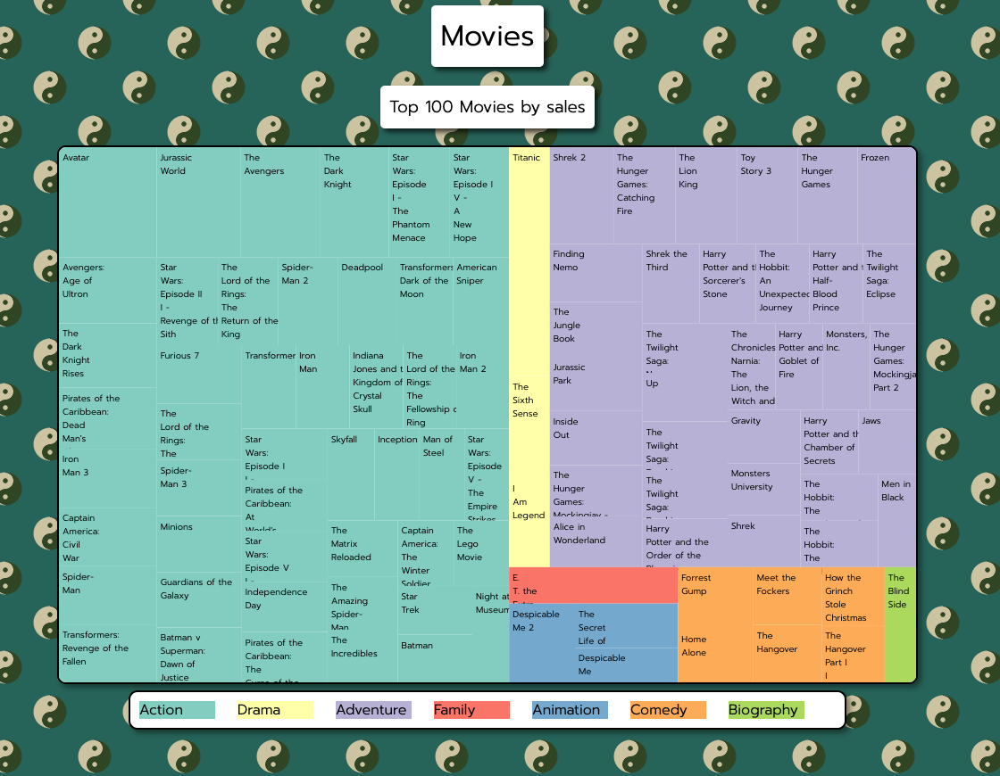

# visualize-data-tree-map

 

</a>

 

## Summary

This is a basic project from the "Data Visualization" FreeCodeCamp course. It allows you to see the top 100 movies, organized by sales on a Heatmap

Each color represents a different genre, and you can put the mouse cursor on top of each to see more info
